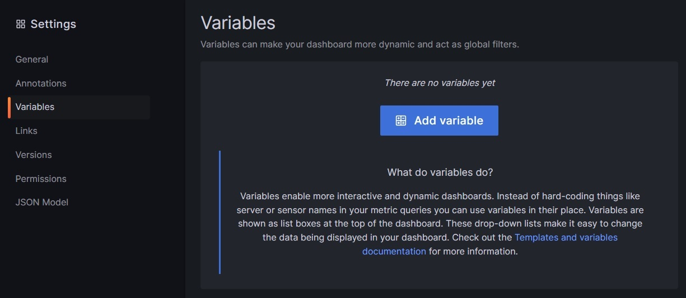

# Create Docker Container Resource Consumption Dashboard

## Overview

In this guide, we will create a dashboard that displays the resource consumption of a Docker container using Grafana, Prometheus, and cAdvisor.

## Prometheus Queries

Through the next prometheus queries the following information will be displayed.

### Percentage  of CPU Usage

The following query returns the percentage of CPU usage of the containers separated by name and instance.

```promql
sum by (name, instance)  (irate(container_cpu_usage_seconds_total{name=~".+"}[5m])) * 100
```

1. `sum by (name, instance)`: Returns the sum of the values of the `irate(container_cpu_usage_seconds_total[5m])` metric grouped by the `name` and `instance` labels.
 
2. `irate(container_cpu_usage_seconds_total[5m])`: Returns the per-second rate of increase of the counter value of the `container_cpu_usage_seconds_total` metric over the last 5 minutes.

3. `* 100`: Multiplies the result of the previous query by 100 to get the percentage.

### Percentage of System Usage

The following query returns the percentage of system usage of the containers separated by name and instance.

```promql
sum by (instance, name) (irate(container_cpu_system_seconds_total{name=~".+"}[5m])) * 100
```

1. `sum by (instance, name)`: Returns the sum of the values of the `irate(container_cpu_system_seconds_total[5m])` metric grouped by the `instance` and `name` labels.

2. `irate(container_cpu_system_seconds_total[5m])`: Returns the per-second rate of increase of the counter value of the `container_cpu_system_seconds_total` metric over the last 5 minutes.

3. `* 100`: Multiplies the result of the previous query by 100 to get the percentage.

### Memory Usage

```promql
container_memory_usage_bytes{name=~".+"}
```

### Number of times the container hit's memory maximum limit

```promql
container_memory_failcnt{name=~".+"}
```

### Maximum memory usage

```promql
container_memory_max_usage_bytes{name=~".+"}
```

### Network bytes received

```promql
irate(container_network_receive_bytes_total{name=~".+"}[5m])
```

### Network received errors

```promql
irate(container_network_receive_errors_total{name=~".+"}[5m])
```

### Network bytes transmitted

```promql
irate(container_network_transmit_bytes_total{name=~".+"}[5m])
```

### Network errors transmitted

```promql
irate(container_network_transmit_errors_total{name=~".+"}[5m])
```

## Grafana Dashboard

### Create a new dashboard


### Create variable for containers name

1. Go to the `Dashboard Settings` section of Grafana.

    

2. Click on `Variables` and select create `new Variable`.

    

3. Set variable type to `Query`.

4. Set the `Data source` to `Prometheus`.

5. Set the `Query`:

    ```promql
    label_values(container_cpu_usage_seconds_total, name)
    ```

    This query returns the values of the `name` label of the `container_cpu_usage_seconds_total` metric.

6. In selection options set `Multi-value` and `Include All`.

### Create variable for containers instance

Repeat the previous steps but with the following query:

```promql
label_values(container_cpu_usage_seconds_total, instance)
```

### Create panels


## References

- [Create variables in grafana](https://grafana.com/docs/grafana/latest/dashboards/variables/add-template-variables/)