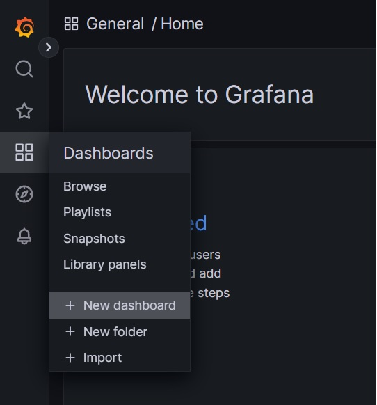
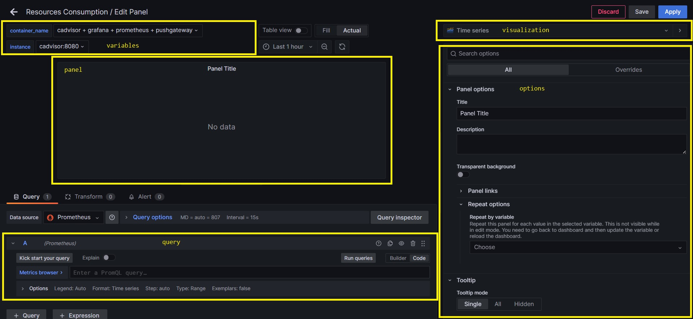

# Create Docker Container Resource Consumption Dashboard

## Overview

In this guide, we will create a dashboard that displays the resource consumption of a Docker container using Grafana, Prometheus, and cAdvisor.

## Grafana Dashboard

### Create a new dashboard



### Create variable for containers name

1. Go to the `Dashboard Settings` section of Grafana.

    

2. Click on `Variables` and select create `new Variable`.

    

3. Set variable type to `Query`.

4. Set the `Data source` to `Prometheus`.

5. Set the `Query`:

    ```promql
    label_values(container_cpu_usage_seconds_total, name)
    ```

    This query returns the values of the `name` label of the `container_cpu_usage_seconds_total` metric.

6. In selection options set `Multi-value` and `Include All`.

### Create variable for containers instance

Repeat the previous steps but with the following query:

```promql
label_values(container_cpu_usage_seconds_total, instance)
```

### Create rows

Click on `Add panel` and then in `Add new row`.


### Create panels

Click on `Add panel` and then in `Add new panel`.


Once inside the panel configuration, you will see a screen like the following:



It's possible to identify the following sections:

- `panel`: This section display the panel based on the query and the configuration we set.
- `variables`: This section allow us to select the variables we configured previously changing the data displayed on the panel.
- `query`: This section allow us to configure the query that will be displayed on the panel.
- `visualization`: This changes allow us to change the visualization type of the panel being displayed. Some of the available options are: 
  - *Time series*
  - *Gauge*
  - *Bar Chart*
  - *Histogram*
  - *...*

    You can find more information about the visualization types in the [official documentation](https://grafana.com/docs/grafana/latest/panels/visualizations/).

- `options`: This section allow us to configure the panel options which are grouped in the following categories:  
    - Panel options
    - Tooltip
    - Legend
    - Axis
    - Graph style
    - Standard options
    - Data links
    - Value mappings
    - Thresholds
    
    We will not cover all the options in this guide, but you can find more information about them in the [official documentation](https://grafana.com/docs/grafana/latest/panels/).


### CPU Row

#### % Cpu Usage

- **title**: *% Cpu Usage*
- **visualization**: *Time series*
- **query**: 
  
    ```promql
    sum by (instance, name) (irate(container_cpu_usage_seconds_total{name=~"$container_name", instance="$instance"}[$__rate_interval]))
    ```
    - `$container_name`: This variable is set in the `variables` section of the panel configuration. It is configured in Grafana.
    - `$instance`: This variable is set in the `variables` section of the panel configuration. It is configured in Grafana.
    - `$__rate_interval`: This variable's value is set by Grafana. It is a time interval set by grafana.
    - `container_cpu_usage_seconds_total`: This is a metric. It is provided by cAdvisor. 
    - `{name=~"$container_name", instance="$instance"}`: This is a label selector. It selects the metrics that have the `name` label equal to the value of the `$container_name` variable and the `instance` label equal to the value of the `$instance` variable.
    - `[$__rate_interval]`: This is a range vector. It selects the metrics that are in the time interval set by the `$__rate_interval` variable.
    - `irate`: This function returns the per-second instant rate of increase of the time series in the range vector. This function is provided by Prometheus.
    - `sum`: This is an aggregation function. It sums the values of the metrics in the range vector.
    - `by (instance, name)`: This is an aggregation function. It groups the metrics by the `instance` and `name` labels.

#### % Cpu System Usage

- **title**: *% Cpu System Usage*
- **visualization**: *Time series*
- **query**: 

    ```promql
    sum by (instance, name) (irate(container_cpu_system_seconds_total{name=~"$container_name", instance="$instance"}[$__rate_interval]))
    ```

### Memory Row

#### Hits Memory Maximum Usage

- **title**: *Hits Memory Maximum Usage*
- **visualization**: *Gauge*
- **query**: 

    ```promql
    container_memory_failcnt{name=~"$container_name", instance="$instance"}
    ```

#### Max Memory Usage

- **title**: *Max Memory Usage*
- **visualization**: *Gauge*
- **query**: 

    ```promql
    container_memory_max_usage_bytes{name=~"$container_name", instance="$instance"}
    ```

#### Memory Usage

- **title**: *Memory Usage*
- **visualization**: *Time series*
- **query**:

    ```promql
    container_memory_usage_bytes{name=~"$container_name", instance="$instance"}
    ```

#### Network Row

#### Received Bytes

- **title**: *Received Bytes*
- **visualization**: *Time series*
- **query**:

    ```promql
    irate(container_network_receive_bytes_total{name=~"$container_name", instance="$instance"}[$__rate_interval])
    ```

### Received Errors

- **title**: *Received Errors*
- **visualization**: *Time series*
- **query**:

    ```promql
    irate(container_network_receive_errors_total{name=~"$container_name", instance="$instance"}[$__rate_interval])
    ```

### Transmitted Bytes

- **title**: *Transmitted Bytes*
- **visualization**: *Time series*
- **query**:

    ```promql
    irate(container_network_transmit_bytes_total{name=~"$container_name", instance="$instance"}[$__rate_interval])
    ```

### Transmitted Errors

- **title**: *Transmitted Errors*
- **visualization**: *Time series*
- **query**:

    ```promql
    irate(container_network_transmit_errors_total{name=~"$container_name", instance="$instance"}[$__rate_interval])
    ```

## Artillery Metrics

Artillery metrics are obtainer through the prometheus's pushgateway because artillery is an application with a short life cycle which may not be available when prometheus scrapes the metrics. 
This means that it won't be possible to get the values until the artillery test has sent the metrics to the pushgateway. Besides, when the artillery test finishes, the last values will be kept in the pushgateway until the next artillery test is executed.

Artillery metrics are grouped in the pushgateway with the following names:

- `artillery_counters`:
- `artillery_summaries`
- `artillery_rates`

Each of these groups contains multiple metrics in the label `metric`.

### Artillery Variables

Create the followings variables with based on the steps described previously:

#### Test Id

- **name**: *test_id*
- **label**: *test_id*
- **query**: 

    ```promql
    label_values(artillery_counters, testId)
    ```
- **refresh**: *On time range change*

### Artillery Counters

- **name**: *artillery_metric_counters*
- **label**: *artillery_metric_counters*
- **query**:
    ```promql
    label_values(artillery_counters{testId="$test_id"}, metric)
    ```
- **refresh**: *On time range change*
- **multi-value**: *true*

### Artillery Summaries

- **name**: *artillery_metric_summaries*
- **label**: *artillery_metric_summaries*
- **query**:
    ```promql
    label_values(artillery_summaries{testId="$test_id"}, metric)
    ```
- **refresh**: *On time range change*
- **multi-value**: *true*

### Artillery Rates

- **name**: *artillery_metric_rates*
- **label**: *artillery_metric_rates*
- **query**:
    ```promql
    label_values(artillery_rates{testId="$test_id"}, metric)
    ```
- **refresh**: *On time range change*
- **multi-value**: *true*

#### Artillery Panels

Create the following panels based on the steps described previously:

#### Artillery Counters Metric

#### Counters

- **title**: *Artillery Counters*
- **repeat by variable**: *artillery_counters_metric*
- **visualization**: *Time series*
- **query**:
    ```promql
    artillery_counters{testId="$test_id", metric=~"$artillery_metric_counters"}
    ```

#### Summaries

- **title**: *Artillery Summaries*
- **repeat by variable**: *artillery_summaries_metric*
- **visualization**: *Time series*
- **query**:

    ```promql
    artillery_summaries{testId="$test_id", metric=~"$artillery_metric_summaries"}
    ```

#### Rates

- **title**: *Artillery Rates*
- **repeat by variable**: *artillery_rates_metric*
- **visualization**: *Time series*
- **query**:

    ```promql
    artillery_rates{testId="$test_id", metric=~"$artillery_metric_summaries"}
    ```

## References

- [Create variables in grafana](https://grafana.com/docs/grafana/latest/dashboards/variables/add-template-variables/)

- [visualization in grafana](https://grafana.com/docs/grafana/latest/panels/visualizations/)

- [grafana panel options](https://grafana.com/docs/grafana/latest/panels/)

- [artillery metrics](https://www.artillery.io/docs/guides/plugins/plugin-publish-metrics#prometheus-pushgateway)