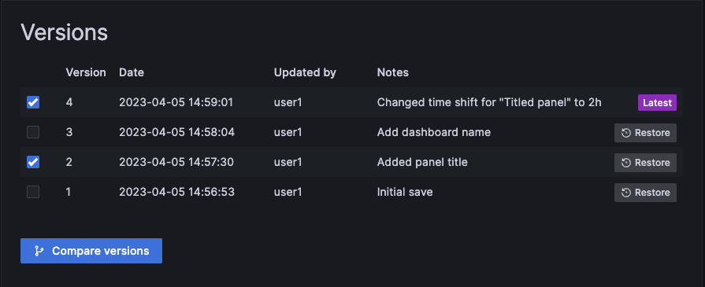
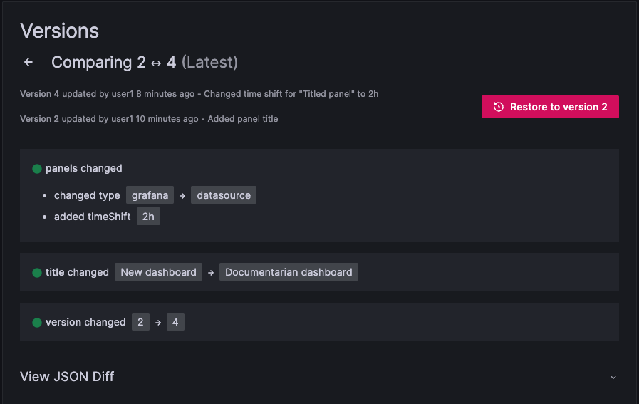

# Dashboard Creation and Version Control in Grafana

## Introduction

Creating and managing dashboards is an essential part of Grafana's functionality. Whether you're a beginner or an experienced user, Grafana offers several ways to create your dashboards and maintain version control. In this guide, we will explore two primary approaches: using the UI and dashboards as code.

## Using the UI

One of the easiest ways to create a dashboard in Grafana is through the user interface (UI). With just a few clicks, you can effortlessly create a dashboard tailored to your needs. The UI provides an intuitive and user-friendly experience, making it accessible to users with different levels of technical expertise.

### Version Control in the UI

Grafana takes version control a step further with a built-in version control system. This unique feature allows you to create and save multiple versions of your dashboard right within the interface. You can seamlessly compare these versions and track changes over time.

### Exporting as JSON**

In addition, Grafana allows you to export your dashboard as a JSON file. This JSON file can be stored in an external repository, allowing you to manage versions of your dashboard outside of Grafana. This integration with external repositories ensures that you have complete control over the version history of your dashboard.

However, it's important to note that when using the UI, the JSON representation of the dashboard can be challenging to work with. It may not be immediately clear what specific changes were made when examining the JSON file. This can make tracking and understanding version changes a bit cumbersome.

## Dashboards as Code

When talking about dashboards as code, there are two aspects to consider: the first is the ability to create dashboards with code, and the second is the ability to manage dashboards with code. In this section, we will explore both aspects.

### Creating Dashboards with Code

Grafana dashboards are stored as json files. This means it would be possible to create them manually although this would be almost impossible for any dashboard beyond the most basic. Fortunately, there are several tools available to generate the json files for you using abstractions and higher-level expressions.

#### Grafonnet-lib

It's a Jsonnet library for Grafana dashboards. Jsonnet is a data templating language that allows you to generate JSON files from a high-level expression. Grafonnet-lib provides a set of functions and objects that allow you to create Grafana dashboards using Jsonnet.

Even so, Grafonnet-lib has been deprecated in favor of more modern solutions. However, it's still worth mentioning as it was once a popular tool for creating dashboards as code.

#### Grafonnet

Grafonnet is the latest version of Grafonnet-lib. It's a Jsonnet library for Grafana dashboards that provides a set of functions and objects for creating dashboards as code. It's better integrated with the latest versions of Grafana dashboards and is actively maintained.

The main advantage of Grafonnet in comparison to Grafonnet-lib is that it's code is autogenerated using the model of Grafana's latest versions. This means that it's always up to date with the latest features and changes in Grafana.

#### Grabana

Grabana is a Go-based solution for simplifying the creation of Grafana dashboards. This tool is tailored for users looking for a developer-friendly way to build Grafana dashboards efficiently. Whether you prefer to work with code or YAML, Grabana's main goals are to provide a simple abstraction over dashboard configuration, expose a developer-friendly API, and increase productivity by enabling integrated development environments (IDEs) and auto-completion support. Grabana streamlines the dashboard creation process, making it accessible and efficient for users with different technical backgrounds.

### Managing Dashboards with Code

In the realm of dashboards as code, we must consider not only the creation, but also the proficient management of these vital resources. This section explores the dynamic landscape of dashboard management with code-based approaches, focusing on declarative methods for effective dashboard control.

You can read more about specific tools and workflows for managing dashboards as code in this [blog post](https://grafana.com/blog/2022/12/06/a-complete-guide-to-managing-grafana-as-code-tools-tips-and-tricks/).

There you will find information about the main tools in the ecosystem, such as [Grizzly](https://github.com/grafana/grizzly), the [Grafana Terraform Provider](https://registry.terraform.io/providers/grafana/grafana/latest/docs), and the [Grafana Ansible Collection](https://github.com/grafana/grafana-ansible-collection).

## Conclusion

In summary, Dashboards as Code provides a structured and version-controlled approach to managing Grafana dashboards. While it may present a learning curve and challenges in visualizing differences, it provides a powerful means to ensure consistency and automation in your dashboard management. Your choice of tool or approach depends on your expertise and project requirements.

## References

- [Manage dashboard version history](https://grafana.com/docs/grafana/latest/dashboards/build-dashboards/manage-version-history/)
### Code tools to create Dashboards as Code 
- [A complete guide to managing Grafana as code: tools, tips, and tricks](https://grafana.com/blog/2022/12/06/a-complete-guide-to-managing-grafana-as-code-tools-tips-and-tricks/)
#### Using Grafonnet
- [How to configure Grafana as code](https://grafana.com/blog/2020/02/26/how-to-configure-grafana-as-code/?pg=blog&plcmt=body-txt)
- [Grafana as code](https://medium.com/@tarantool/grafana-as-code-b642cac9ae75)
- [Grafonnet repository](https://github.com/grafana/grafonnet-lib)
- [PromCon EU 2019: Managing Grafana Dashboards with grafonnet and git](https://www.youtube.com/watch?v=kV3Ua6guynI&ab_channel=PrometheusMonitoring)
- [Grabana](https://github.com/K-Phoen/grabana)
- [Grizzly](https://github.com/grafana/grizzly)
- [Grafana Terraform Provider](https://registry.terraform.io/providers/grafana/grafana/latest/docs)
- [Grafana Ansible Collection](https://github.com/grafana/grafana-ansible-collection)
