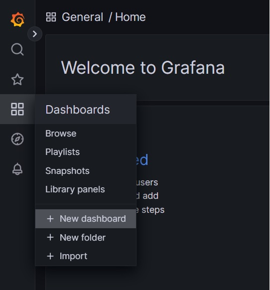
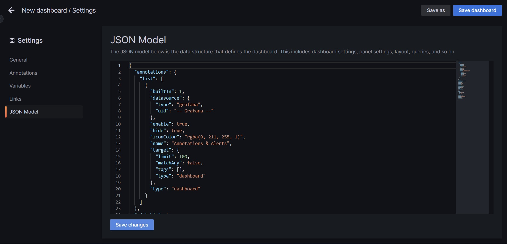
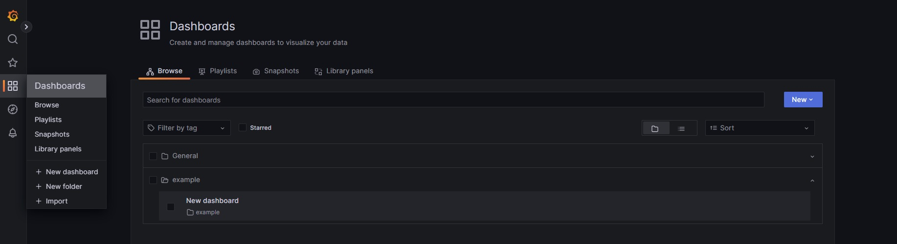
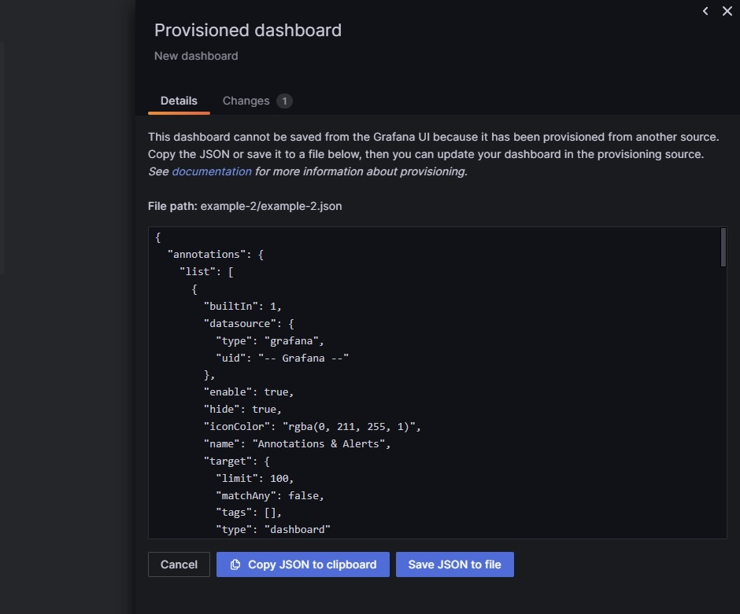

# How to Create and Mantain Dashboard Through Provisioning

## Introduction

In this document, we will explain how to create and maintain dashboards through provisioning.

## Pre-requisites

- Create a docker `Volume` for grafana for provisioning:
```yaml
services:
    ...
    grafana:
        ...
        volumes:
            - './grafana/provisioning/:/etc/grafana/provisioning/'
```
- Inside this volume, create a directory called `dashboards` and a file called `dashboards.yaml`:

> #### Example From Grafana Documentation
> ```yaml
> apiVersion: 1
> 
> providers:
>   # <string> an unique provider name. Required
>   - name: 'a unique provider name'
>     # <int> Org id. Default to 1
>     orgId: 1
>     # <string> name of the dashboard folder.
>     folder: ''
>     # <string> folder UID. will be automatically generated if not specified
>     folderUid: ''
>     # <string> provider type. Default to 'file'
>     type: file
>     # <bool> disable dashboard deletion
>     disableDeletion: false
>     # <int> how often Grafana will scan for changed dashboards
>     updateIntervalSeconds: 10
>     # <bool> allow updating provisioned dashboards from the UI
>     allowUiUpdates: false
>     options:
>       # <string, required> path to dashboard files on disk. Required when > using the 'file' type
>       path: /var/lib/grafana/dashboards
>       # <bool> use folder names from filesystem to create folders in Grafana
>       foldersFromFilesStructure: true
> ```

The current configuration is in the following path: `.grafana/provisioning/dashboards/dashboards.yaml`. Key configuration settings include:

- `disableDeletion` (false): This way every time we update a dashboard JSON, it will be updated in Grafana removing the previous version.
- `allowUiUpdates` (false): This setting will let us update the dashboard but instead of updating saving it directly, it will force us to save it as JSON.
- `path` (etc/grafana/provisioning/dashboards): It determines the path where we will store the dashboard JSON files.
- `foldersFromFilesStructure` (true): This way Grafana will create folders based on the system's 

## Workflow

### Create a dashboard

Select the "New Dashboard" option.



In this new dashboard, you can add panels, change the title, etc. To save the dashboard. Click on the dashboards's settings.


Select JSON Model and copy the JSON in the clipboard.



In the directory we have set on the `path` configuration, create a folder where we will store the dashboard JSON files. In this example, we will create a folder called `example` and copy inside it the JSON file we have copied from Grafana: 

```bash 
.
└── grafana
    └── provisioning
        └── dashboards
            ├── dashboard.yml
            └── example # New folder
                └── example.json # New file
```

Now, if you go to Grafana, you will see the new dashboard (the JSON file's name and the dashboard's name do not have to match).



### Update a dashboard

Select the Dashboard and make some change in it. This time, when you save, you will see this message:



Now you can save the dashboard as JSON and copy it to the JSON file or you can save it to a file and replace the old version with the new one.

## References

- [Provisioning dashboards](https://grafana.com/docs/grafana/latest/administration/provisioning/#dashboards)
- [Provision folders from filesystem](https://grafana.com/docs/grafana/latest/administration/provisioning/#provision-folders-structure-from-filesystem-to-grafana)